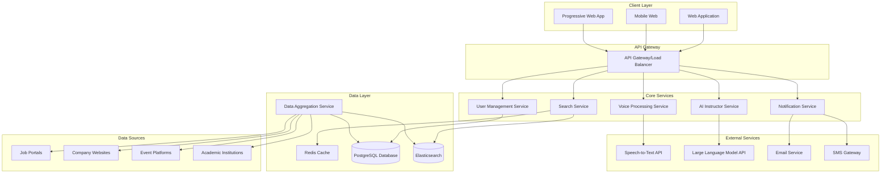

# Design Document: OpportuneX

## Overview

OpportuneX is an AI-powered platform that aggregates hackathons, internships, and workshops from multiple sources and provides intelligent search capabilities through natural language and voice interfaces. The platform specifically targets students from Tier 2 and Tier 3 cities in India, offering personalized preparation roadmaps through an AI Instructor component.

The system architecture follows a microservices pattern with distinct components for data aggregation, AI-powered search, voice processing, and personalized recommendations. The platform emphasizes mobile-first design, low-bandwidth optimization, and multilingual support (English and Hindi).

## Architecture

### High-Level Architecture



### Service Architecture

The platform uses a microservices architecture with the following key services:

1. **API Gateway**: Routes requests, handles authentication, rate limiting, and load balancing
2. **Search Service**: Processes natural language queries and returns relevant opportunities
3. **Voice Processing Service**: Handles speech-to-text conversion and voice command processing
4. **AI Instructor Service**: Generates personalized preparation roadmaps
5. **Data Aggregation Service**: Collects and processes opportunities from external sources
6. **User Management Service**: Handles user profiles, preferences, and authentication
7. **Notification Service**: Manages email, SMS, and in-app notifications

## Components and Interfaces

### Frontend Components

#### Web Application (React/Next.js)
- **Search Interface**: Natural language search input with voice activation button
- **Results Display**: Paginated opportunity listings with filtering options
- **User Profile**: Skills, preferences, and notification settings management
- **AI Instructor Dashboard**: Personalized roadmaps and progress tracking
- **Mobile-Responsive Design**: Optimized for various screen sizes and touch interactions

#### Progressive Web App Features
- **Offline Capability**: Cache recent searches and favorite opportunities
- **Push Notifications**: Browser-based notifications for new opportunities
- **App-like Experience**: Install prompt and native app feel

### Backend API Interfaces

#### Search API
```typescript
interface SearchRequest {
  query: string;
  filters?: {
    skills?: string[];
    organizerType?: 'corporate' | 'startup' | 'government' | 'academic';
    mode?: 'online' | 'offline' | 'hybrid';
    location?: string;
    type?: 'hackathon' | 'internship' | 'workshop';
  };
  pagination?: {
    page: number;
    limit: number;
  };
  userId?: string;
}

interface SearchResponse {
  opportunities: Opportunity[];
  totalCount: number;
  suggestions?: string[];
  facets?: SearchFacets;
}
```

#### Voice Processing API
```typescript
interface VoiceRequest {
  audioData: Blob;
  language: 'en' | 'hi';
  userId?: string;
}

interface VoiceResponse {
  transcription: string;
  searchQuery: string;
  confidence: number;
  followUpQuestions?: string[];
}
```

#### AI Instructor API
```typescript
interface RoadmapRequest {
  opportunityId: string;
  userProfile: UserProfile;
  targetDate?: Date;
}

interface RoadmapResponse {
  roadmap: {
    phases: RoadmapPhase[];
    estimatedDuration: number;
    resources: Resource[];
    milestones: Milestone[];
  };
  personalizedTips: string[];
}
```

### Data Aggregation Components

#### Web Scraping Engine
- **Scrapy-based Framework**: Distributed scraping with rotating proxies
- **Rate Limiting**: Respectful scraping with configurable delays
- **Anti-Detection**: User agent rotation and CAPTCHA handling
- **Data Validation**: Schema validation and duplicate detection

#### API Integration Layer
- **REST API Clients**: For platforms providing official APIs
- **GraphQL Clients**: For modern platforms using GraphQL
- **Webhook Handlers**: For real-time updates from partner platforms
- **Data Normalization**: Standardize data formats across sources

## Data Models

### Core Data Models

#### Opportunity Model
```typescript
interface Opportunity {
  id: string;
  title: string;
  description: string;
  type: 'hackathon' | 'internship' | 'workshop';
  organizer: {
    name: string;
    type: 'corporate' | 'startup' | 'government' | 'academic';
    logo?: string;
  };
  requirements: {
    skills: string[];
    experience?: string;
    education?: string;
    eligibility: string[];
  };
  details: {
    mode: 'online' | 'offline' | 'hybrid';
    location?: string;
    duration?: string;
    stipend?: string;
    prizes?: string[];
  };
  timeline: {
    applicationDeadline: Date;
    startDate?: Date;
    endDate?: Date;
  };
  externalUrl: string;
  sourceId: string;
  tags: string[];
  createdAt: Date;
  updatedAt: Date;
  isActive: boolean;
}
```

#### User Profile Model
```typescript
interface UserProfile {
  id: string;
  email: string;
  name: string;
  phone?: string;
  location: {
    city: string;
    state: string;
    tier: 2 | 3;
  };
  academic: {
    institution: string;
    degree: string;
    year: number;
    cgpa?: number;
  };
  skills: {
    technical: string[];
    domains: string[];
    proficiencyLevel: 'beginner' | 'intermediate' | 'advanced';
  };
  preferences: {
    opportunityTypes: ('hackathon' | 'internship' | 'workshop')[];
    preferredMode: 'online' | 'offline' | 'hybrid' | 'any';
    maxDistance?: number;
    notifications: NotificationPreferences;
  };
  searchHistory: SearchQuery[];
  favoriteOpportunities: string[];
  createdAt: Date;
  updatedAt: Date;
}
```

#### AI Roadmap Model
```typescript
interface RoadmapPhase {
  id: string;
  title: string;
  description: string;
  duration: number; // in days
  tasks: Task[];
  resources: Resource[];
  prerequisites?: string[];
}

interface Task {
  id: string;
  title: string;
  description: string;
  estimatedHours: number;
  priority: 'high' | 'medium' | 'low';
  type: 'learning' | 'practice' | 'project' | 'assessment';
  completed: boolean;
}

interface Resource {
  id: string;
  title: string;
  type: 'article' | 'video' | 'course' | 'book' | 'practice';
  url: string;
  duration?: number;
  difficulty: 'beginner' | 'intermediate' | 'advanced';
  free: boolean;
}
```

### Database Schema

#### PostgreSQL Tables
- **users**: User profiles and authentication data
- **opportunities**: Aggregated opportunity listings
- **sources**: Data source configurations and metadata
- **user_searches**: Search history and analytics
- **roadmaps**: Generated preparation roadmaps
- **notifications**: Notification queue and delivery status
- **user_preferences**: Detailed user preference settings

#### Elasticsearch Indices
- **opportunities_index**: Full-text search and faceted filtering
- **user_behavior_index**: Search analytics and recommendation data

## Correctness Properties

*A property is a characteristic or behavior that should hold true across all valid executions of a system—essentially, a formal statement about what the system should do. Properties serve as the bridge between human-readable specifications and machine-verifiable correctness guarantees.*

Let me analyze the acceptance criteria to determine which ones can be tested as properties.

### Property-Based Testing Properties

Based on the prework analysis and property reflection, here are the key correctness properties:

**Property 1: Comprehensive Search Relevance**
*For any* search query (text or voice) in English or Hindi, all returned opportunities should be relevant to the query intent and match the specified opportunity types (hackathon, internship, workshop)
**Validates: Requirements 1.1, 2.1, 2.2**

**Property 2: Filter Combination Correctness**
*For any* combination of filters (skills, organizer type, mode, location), all returned opportunities should satisfy every applied filter criterion simultaneously
**Validates: Requirements 4.1, 4.2, 4.3, 4.4, 4.5**

**Property 3: Voice Processing Pipeline**
*For any* clear voice input in English or Hindi, the voice-to-search pipeline should produce equivalent results to the same query entered as text
**Validates: Requirements 3.1, 3.2, 3.3**

**Property 4: Opportunity Display Completeness**
*For any* opportunity displayed to users, the display should include all essential details: title, organizer, deadline, and requirements
**Validates: Requirements 1.3**

**Property 5: Data Source Aggregation**
*For any* aggregated opportunity, it should come from a verified source, be in standardized format, and meet minimum data quality requirements
**Validates: Requirements 9.1, 9.2, 9.4**

**Property 6: Duplicate Detection and Merging**
*For any* set of opportunities with identical titles and organizers, the system should merge them into a single listing while preserving all unique information
**Validates: Requirements 9.3**

**Property 7: AI Roadmap Generation**
*For any* opportunity and user profile combination, the AI Instructor should generate a roadmap containing learning resources, timelines, milestones, and content appropriate for the opportunity type
**Validates: Requirements 6.1, 6.3, 6.4**

**Property 8: Personalized Roadmap Adaptation**
*For any* two users with different skill levels requesting roadmaps for the same opportunity, the generated roadmaps should have appropriately different content and difficulty levels
**Validates: Requirements 6.2**

**Property 9: Profile-Based Personalization**
*For any* two users with different profiles searching for the same query, the search results should be appropriately personalized based on their skills, interests, and location preferences
**Validates: Requirements 7.2**

**Property 10: Profile Update Propagation**
*For any* user profile update, subsequent search results and recommendations should immediately reflect the changes
**Validates: Requirements 7.3**

**Property 11: Notification Matching and Preferences**
*For any* new opportunity that matches a user's profile, a notification should be generated only if it respects the user's notification preferences for frequency, timing, and channels
**Validates: Requirements 8.1, 8.4, 8.5**

**Property 12: External Link Integrity**
*For any* opportunity, the external URL should be valid and link directly to the original platform where the opportunity was posted
**Validates: Requirements 5.1**

**Property 13: Error Handling for Voice Input**
*For any* voice input with low confidence score, the system should request clarification or suggest text input as an alternative
**Validates: Requirements 3.4**

**Property 14: Contextual Query Handling**
*For any* follow-up query like "show me more like this", the system should maintain context from the previous search and return related opportunities
**Validates: Requirements 2.4**

**Property 15: Quality Control and Fraud Detection**
*For any* opportunity with suspicious characteristics (missing contact info, unrealistic promises, unverified sources), the system should flag it for review
**Validates: Requirements 12.3**

## Error Handling

### Search Service Error Handling
- **Query Processing Errors**: Return user-friendly error messages for malformed queries
- **Service Timeouts**: Implement circuit breakers with fallback to cached results
- **External API Failures**: Graceful degradation with partial results from available sources
- **Voice Recognition Errors**: Provide text input fallback and confidence scoring

### Data Aggregation Error Handling
- **Source Unavailability**: Continue aggregation from available sources, log failures
- **Rate Limiting**: Implement exponential backoff and request queuing
- **Data Validation Failures**: Quarantine invalid data, alert administrators
- **Duplicate Detection Errors**: Default to keeping separate entries, manual review

### AI Instructor Error Handling
- **LLM API Failures**: Provide template-based roadmaps as fallback
- **Invalid User Profiles**: Request profile completion before roadmap generation
- **Resource Unavailability**: Suggest alternative resources, maintain roadmap structure

### User Management Error Handling
- **Authentication Failures**: Clear error messages, password reset options
- **Profile Update Conflicts**: Last-write-wins with conflict notification
- **Notification Delivery Failures**: Retry with exponential backoff, fallback channels

## Testing Strategy

### Dual Testing Approach

The testing strategy employs both unit testing and property-based testing to ensure comprehensive coverage:

**Unit Tests**:
- Specific examples and edge cases for each component
- Integration points between services
- Error conditions and boundary cases
- API contract validation
- Database operations and data integrity

**Property-Based Tests**:
- Universal properties that hold across all inputs
- Comprehensive input coverage through randomization
- Correctness validation for core business logic
- Data consistency and invariant preservation

### Property-Based Testing Configuration

**Testing Framework**: Use Hypothesis (Python) or fast-check (TypeScript/JavaScript) for property-based testing
**Test Configuration**: Minimum 100 iterations per property test to ensure statistical confidence
**Test Tagging**: Each property test must reference its design document property with the format:
- **Feature: opportunex, Property 1: Comprehensive Search Relevance**
- **Feature: opportunex, Property 2: Filter Combination Correctness**

### Testing Coverage Requirements

**Search Service Testing**:
- Property tests for search relevance across various query types
- Unit tests for specific search scenarios and edge cases
- Integration tests for voice-to-search pipeline
- Performance tests for response time requirements

**Data Aggregation Testing**:
- Property tests for data standardization and validation
- Unit tests for specific source integrations
- Integration tests for duplicate detection algorithms
- End-to-end tests for complete aggregation workflows

**AI Instructor Testing**:
- Property tests for roadmap generation consistency
- Unit tests for specific roadmap scenarios
- Integration tests with external LLM APIs
- User acceptance tests for roadmap quality

**User Management Testing**:
- Property tests for profile-based personalization
- Unit tests for authentication and authorization
- Integration tests for notification delivery
- Security tests for data protection compliance

### Test Data Management

**Synthetic Data Generation**: Create realistic test data for opportunities, user profiles, and search queries
**Data Privacy**: Use anonymized production data samples where appropriate
**Test Environment Isolation**: Separate test databases and external service mocks
**Continuous Integration**: Automated test execution on every code change

### Performance Testing

**Load Testing**: Simulate concurrent user loads up to 10,000 active users
**Stress Testing**: Test system behavior under extreme load conditions
**Bandwidth Testing**: Validate performance on low-bandwidth connections
**Mobile Testing**: Test voice processing and UI responsiveness on mobile devices

The testing strategy ensures that both specific functionality (unit tests) and general correctness properties (property tests) are validated, providing confidence in the system's reliability and correctness across all use cases.