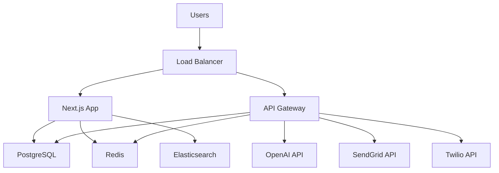

# OpportuneX Disaster Recovery Plan

This document outlines the comprehensive disaster recovery procedures for the OpportuneX platform, ensuring business continuity and minimal downtime in case of system failures, data loss, or other catastrophic events.

## Table of Contents

1. [Overview](#overview)
2. [Recovery Objectives](#recovery-objectives)
3. [Disaster Scenarios](#disaster-scenarios)
4. [Recovery Procedures](#recovery-procedures)
5. [Communication Plan](#communication-plan)
6. [Testing and Validation](#testing-and-validation)
7. [Maintenance and Updates](#maintenance-and-updates)

## Overview

### Purpose

This Disaster Recovery Plan (DRP) provides step-by-step procedures to restore OpportuneX services in the event of a disaster. The plan is designed to minimize downtime, prevent data loss, and ensure rapid recovery of critical business functions.

### Scope

This plan covers:
- **Application Services**: Next.js frontend, API Gateway, and microservices
- **Data Systems**: PostgreSQL database, Redis cache, Elasticsearch indices
- **Infrastructure**: Kubernetes cluster, networking, and storage
- **External Dependencies**: Third-party APIs and services

### Assumptions

- Backups are performed regularly and are accessible
- Recovery team members are available and trained
- Alternative infrastructure resources are available
- Communication channels are operational

## Recovery Objectives

### Recovery Time Objective (RTO)

Maximum acceptable downtime for each service:

| Service | RTO | Priority |
|---------|-----|----------|
| Web Application | 4 hours | Critical |
| API Gateway | 2 hours | Critical |
| Search Service | 6 hours | High |
| User Authentication | 1 hour | Critical |
| Notifications | 8 hours | Medium |
| AI Instructor | 12 hours | Medium |

### Recovery Point Objective (RPO)

Maximum acceptable data loss:

| Data Type | RPO | Backup Frequency |
|-----------|-----|------------------|
| User Data | 1 hour | Continuous replication |
| Opportunity Data | 4 hours | Every 4 hours |
| Search Indices | 6 hours | Daily |
| Application Logs | 24 hours | Daily |
| System Metrics | 1 hour | Real-time |

### Service Level Objectives

- **Availability**: 99.9% uptime (8.76 hours downtime per year)
- **Performance**: 95th percentile response time < 2 seconds
- **Data Integrity**: Zero data corruption tolerance
- **Security**: Maintain all security controls during recovery

## Disaster Scenarios

### Scenario 1: Single Service Failure

**Description**: Individual service (app, API, database) becomes unavailable
**Impact**: Partial service degradation
**Probability**: High
**Detection**: Automated monitoring alerts

### Scenario 2: Database Corruption/Loss

**Description**: PostgreSQL database corruption or complete data loss
**Impact**: Complete service unavailability
**Probability**: Medium
**Detection**: Database health checks, application errors

### Scenario 3: Kubernetes Cluster Failure

**Description**: Complete cluster failure or node unavailability
**Impact**: Complete service unavailability
**Probability**: Medium
**Detection**: Cluster monitoring, pod status checks

### Scenario 4: Data Center Outage

**Description**: Complete data center or cloud region unavailability
**Impact**: Complete service unavailability
**Probability**: Low
**Detection**: Infrastructure monitoring, external monitoring

### Scenario 5: Security Breach

**Description**: Unauthorized access, data breach, or malware infection
**Impact**: Service shutdown for investigation
**Probability**: Low
**Detection**: Security monitoring, anomaly detection

### Scenario 6: Third-party Service Failure

**Description**: Critical external services (OpenAI, SendGrid, etc.) unavailable
**Impact**: Feature degradation
**Probability**: Medium
**Detection**: API health checks, error rate monitoring

## Recovery Procedures

### General Recovery Process

1. **Incident Detection and Assessment**
2. **Team Activation and Communication**
3. **Damage Assessment and Scope Determination**
4. **Recovery Strategy Selection**
5. **Recovery Execution**
6. **Service Validation and Testing**
7. **Service Restoration**
8. **Post-Incident Review**

### Scenario 1: Single Service Failure

#### Detection
```bash
# Check service status
kubectl get pods -n opportunex
kubectl get services -n opportunex

# Check service health
curl -f https://opportunex.com/api/health
```

#### Recovery Steps

1. **Identify Failed Service**
   ```bash
   # Check pod status
   kubectl describe pod <failed-pod> -n opportunex
   
   # Check logs
   kubectl logs <failed-pod> -n opportunex --tail=100
   ```

2. **Attempt Automatic Recovery**
   ```bash
   # Restart deployment
   kubectl rollout restart deployment/<service-name> -n opportunex
   
   # Scale up replicas if needed
   kubectl scale deployment/<service-name> --replicas=3 -n opportunex
   ```

3. **Manual Intervention (if automatic recovery fails)**
   ```bash
   # Check resource constraints
   kubectl top pods -n opportunex
   kubectl describe nodes
   
   # Check for configuration issues
   kubectl get configmap -n opportunex
   kubectl get secrets -n opportunex
   ```

4. **Validate Recovery**
   ```bash
   # Check service health
   kubectl get pods -n opportunex
   curl -f https://opportunex.com/api/health
   
   # Run smoke tests
   npm run test:smoke
   ```

**Estimated Recovery Time**: 15-30 minutes

### Scenario 2: Database Corruption/Loss

#### Detection
```bash
# Check database connectivity
kubectl exec -it deployment/postgres-deployment -n opportunex -- \
  pg_isready -U postgres -d opportunex

# Check for corruption
kubectl exec -it deployment/postgres-deployment -n opportunex -- \
  psql -U postgres -d opportunex -c "SELECT pg_database_size('opportunex');"
```

#### Recovery Steps

1. **Assess Damage**
   ```bash
   # Check database status
   kubectl logs deployment/postgres-deployment -n opportunex
   
   # Attempt connection
   kubectl exec -it deployment/postgres-deployment -n opportunex -- \
     psql -U postgres -d opportunex -c "\dt"
   ```

2. **Stop Application Services**
   ```bash
   # Scale down applications to prevent further damage
   kubectl scale deployment/opportunex-app-deployment --replicas=0 -n opportunex
   kubectl scale deployment/opportunex-api-deployment --replicas=0 -n opportunex
   ```

3. **Restore from Backup**
   ```bash
   # Find latest backup
   ls -la /var/backups/opportunex/ | tail -5
   
   # Restore database
   bash scripts/restore-database.sh --postgres-only LATEST_BACKUP_TIMESTAMP
   ```

4. **Validate Data Integrity**
   ```bash
   # Check table counts
   kubectl exec -it deployment/postgres-deployment -n opportunex -- \
     psql -U postgres -d opportunex -c "
       SELECT schemaname, tablename, n_tup_ins, n_tup_upd, n_tup_del 
       FROM pg_stat_user_tables;"
   
   # Run data validation queries
   kubectl exec -it deployment/opportunex-app-deployment -n opportunex -- \
     npm run db:validate
   ```

5. **Restart Application Services**
   ```bash
   # Scale up applications
   kubectl scale deployment/opportunex-app-deployment --replicas=3 -n opportunex
   kubectl scale deployment/opportunex-api-deployment --replicas=2 -n opportunex
   
   # Wait for readiness
   kubectl wait --for=condition=ready pod -l app=opportunex-app -n opportunex --timeout=300s
   ```

**Estimated Recovery Time**: 2-4 hours

### Scenario 3: Kubernetes Cluster Failure

#### Detection
```bash
# Check cluster status
kubectl cluster-info
kubectl get nodes
kubectl get pods --all-namespaces
```

#### Recovery Steps

1. **Assess Cluster State**
   ```bash
   # Check node status
   kubectl describe nodes
   
   # Check system pods
   kubectl get pods -n kube-system
   
   # Check cluster events
   kubectl get events --all-namespaces --sort-by='.lastTimestamp'
   ```

2. **Attempt Cluster Recovery**
   ```bash
   # Restart kubelet on nodes (if accessible)
   sudo systemctl restart kubelet
   
   # Drain and uncordon nodes
   kubectl drain <node-name> --ignore-daemonsets --delete-emptydir-data
   kubectl uncordon <node-name>
   ```

3. **Deploy to Alternative Cluster (if primary cluster unrecoverable)**
   ```bash
   # Switch kubectl context
   kubectl config use-context backup-cluster
   
   # Deploy OpportuneX
   bash scripts/deploy-k8s.sh
   
   # Restore data
   bash scripts/restore-database.sh --from-s3 LATEST_BACKUP_TIMESTAMP
   ```

4. **Update DNS and Load Balancer**
   ```bash
   # Update DNS records to point to new cluster
   # Update load balancer configuration
   # Update monitoring endpoints
   ```

**Estimated Recovery Time**: 4-8 hours

### Scenario 4: Data Center Outage

#### Detection
- External monitoring alerts
- Complete loss of connectivity
- Cloud provider status pages

#### Recovery Steps

1. **Activate Secondary Region**
   ```bash
   # Switch to backup region
   export AWS_DEFAULT_REGION=us-west-2
   kubectl config use-context backup-region-cluster
   ```

2. **Deploy Infrastructure**
   ```bash
   # Deploy Kubernetes resources
   bash scripts/deploy-k8s.sh
   
   # Configure networking
   kubectl apply -f k8s/network-policies.yaml
   ```

3. **Restore Data**
   ```bash
   # Restore from S3 backups
   bash scripts/restore-database.sh --from-s3 LATEST_BACKUP_TIMESTAMP
   
   # Verify data integrity
   npm run db:validate
   ```

4. **Update Global Configuration**
   ```bash
   # Update DNS records
   # Update CDN configuration
   # Update monitoring endpoints
   # Update external service webhooks
   ```

5. **Communicate with Users**
   - Send status update emails
   - Update status page
   - Post on social media

**Estimated Recovery Time**: 6-12 hours

### Scenario 5: Security Breach

#### Detection
- Security monitoring alerts
- Unusual access patterns
- Data integrity checks fail

#### Recovery Steps

1. **Immediate Response**
   ```bash
   # Isolate affected systems
   kubectl scale deployment/opportunex-app-deployment --replicas=0 -n opportunex
   
   # Enable maintenance mode
   kubectl patch configmap opportunex-config -n opportunex \
     -p '{"data":{"MAINTENANCE_MODE":"true"}}'
   ```

2. **Forensic Analysis**
   ```bash
   # Collect logs
   kubectl logs deployment/opportunex-app-deployment -n opportunex --since=24h > incident-logs.txt
   
   # Export database for analysis
   kubectl exec deployment/postgres-deployment -n opportunex -- \
     pg_dump -U postgres opportunex > forensic-db-dump.sql
   ```

3. **Clean Recovery**
   ```bash
   # Deploy clean infrastructure
   bash scripts/deploy-k8s.sh
   
   # Restore from known-good backup
   bash scripts/restore-database.sh KNOWN_GOOD_BACKUP_TIMESTAMP
   
   # Update all secrets and keys
   bash scripts/setup-production-env.sh update-secrets
   ```

4. **Security Hardening**
   ```bash
   # Apply security patches
   kubectl apply -f k8s/security-policies.yaml
   
   # Update access controls
   kubectl apply -f k8s/rbac.yaml
   
   # Enable additional monitoring
   kubectl apply -f k8s/security-monitoring.yaml
   ```

**Estimated Recovery Time**: 12-24 hours

### Scenario 6: Third-party Service Failure

#### Detection
```bash
# Check external service health
curl -f https://api.openai.com/v1/models
curl -f https://api.sendgrid.com/v3/user/profile
```

#### Recovery Steps

1. **Enable Fallback Mechanisms**
   ```bash
   # Switch to backup AI provider
   kubectl patch configmap opportunex-config -n opportunex \
     -p '{"data":{"AI_PROVIDER":"backup"}}'
   
   # Enable email fallback
   kubectl patch configmap opportunex-config -n opportunex \
     -p '{"data":{"EMAIL_PROVIDER":"backup"}}'
   ```

2. **Graceful Degradation**
   ```bash
   # Disable affected features
   kubectl patch configmap opportunex-config -n opportunex \
     -p '{"data":{"FEATURE_AI_INSTRUCTOR":"false"}}'
   
   # Show user-friendly messages
   kubectl patch configmap opportunex-config -n opportunex \
     -p '{"data":{"AI_SERVICE_MESSAGE":"AI features temporarily unavailable"}}'
   ```

3. **Monitor and Restore**
   ```bash
   # Monitor external service status
   while ! curl -f https://api.openai.com/v1/models; do
     echo "Waiting for service recovery..."
     sleep 300
   done
   
   # Re-enable features
   kubectl patch configmap opportunex-config -n opportunex \
     -p '{"data":{"FEATURE_AI_INSTRUCTOR":"true"}}'
   ```

**Estimated Recovery Time**: 1-6 hours (depending on external service)

## Communication Plan

### Stakeholder Notification

#### Internal Team
- **Incident Commander**: Immediate notification
- **Development Team**: Within 15 minutes
- **Management**: Within 30 minutes
- **Customer Support**: Within 1 hour

#### External Communication
- **Users**: Status page update within 1 hour
- **Partners**: Email notification within 2 hours
- **Media**: Press release if major incident

### Communication Channels

#### Primary Channels
- **Slack**: #incident-response channel
- **Email**: incident-response@opportunex.com
- **Phone**: Emergency contact list
- **Status Page**: https://status.opportunex.com

#### Backup Channels
- **WhatsApp**: Emergency group
- **Discord**: Backup communication server
- **SMS**: Critical alerts only

### Communication Templates

#### Initial Incident Notification
```
INCIDENT ALERT - OpportuneX

Severity: [Critical/High/Medium/Low]
Service: [Affected Service]
Impact: [User Impact Description]
Start Time: [Timestamp]
Estimated Resolution: [Time Estimate]

Current Status: [Brief Description]
Next Update: [Time]

Incident Commander: [Name]
```

#### Status Update
```
INCIDENT UPDATE - OpportuneX

Incident ID: [ID]
Time: [Timestamp]
Status: [Investigating/Identified/Monitoring/Resolved]

Update: [Progress Description]
Next Steps: [Planned Actions]
Next Update: [Time]
```

#### Resolution Notification
```
INCIDENT RESOLVED - OpportuneX

Incident ID: [ID]
Resolution Time: [Timestamp]
Duration: [Total Downtime]

Summary: [What Happened]
Resolution: [How It Was Fixed]
Prevention: [Steps to Prevent Recurrence]

Post-Incident Review: [Date/Time]
```

## Testing and Validation

### Disaster Recovery Testing Schedule

#### Monthly Tests
- **Service Restart**: Test individual service recovery
- **Backup Validation**: Verify backup integrity and restore process
- **Monitoring Alerts**: Test alert systems and escalation

#### Quarterly Tests
- **Database Recovery**: Full database restore from backup
- **Cluster Failover**: Test Kubernetes cluster recovery
- **Communication Plan**: Test notification systems

#### Annual Tests
- **Full DR Exercise**: Complete disaster recovery simulation
- **Regional Failover**: Test multi-region disaster recovery
- **Security Incident**: Simulate security breach response

### Test Procedures

#### Service Recovery Test
```bash
# 1. Simulate service failure
kubectl delete pod -l app=opportunex-app -n opportunex

# 2. Monitor automatic recovery
kubectl get pods -n opportunex --watch

# 3. Validate service health
curl -f https://opportunex.com/api/health

# 4. Document results
echo "Test completed at $(date)" >> dr-test-log.txt
```

#### Database Recovery Test
```bash
# 1. Create test backup
bash scripts/backup-database.sh

# 2. Simulate data loss (in test environment)
kubectl exec -it deployment/postgres-deployment -n opportunex -- \
  psql -U postgres -d opportunex -c "DROP TABLE test_table;"

# 3. Restore from backup
bash scripts/restore-database.sh LATEST_BACKUP_TIMESTAMP

# 4. Validate data integrity
kubectl exec -it deployment/postgres-deployment -n opportunex -- \
  psql -U postgres -d opportunex -c "SELECT COUNT(*) FROM test_table;"
```

### Test Documentation

Each test must be documented with:
- **Test Date and Time**
- **Test Scenario**
- **Expected Results**
- **Actual Results**
- **Issues Identified**
- **Corrective Actions**
- **Test Duration**
- **Participants**

### Success Criteria

Tests are considered successful if:
- Recovery completes within RTO targets
- Data loss is within RPO limits
- All services pass health checks
- No security vulnerabilities introduced
- Communication plan executed correctly

## Maintenance and Updates

### Plan Review Schedule

#### Monthly Reviews
- Update contact information
- Review and test communication channels
- Update backup retention policies
- Review monitoring thresholds

#### Quarterly Reviews
- Update recovery procedures
- Review RTO/RPO targets
- Update infrastructure documentation
- Review vendor contacts and SLAs

#### Annual Reviews
- Complete plan overhaul
- Update based on lessons learned
- Review and update team training
- Validate insurance coverage

### Change Management

All changes to the disaster recovery plan must:
1. Be reviewed by the incident response team
2. Be tested in a non-production environment
3. Be approved by management
4. Be communicated to all stakeholders
5. Be documented with version control

### Training Requirements

#### New Team Members
- Complete DR plan overview within first week
- Shadow experienced team member during next incident
- Complete hands-on recovery exercise within first month

#### Existing Team Members
- Quarterly DR plan review sessions
- Annual hands-on recovery exercises
- Continuous education on new tools and procedures

#### Management
- Annual DR plan briefing
- Quarterly business impact assessments
- Regular communication plan reviews

### Documentation Updates

Keep the following documents current:
- **Contact Lists**: Emergency contacts and escalation procedures
- **Infrastructure Diagrams**: Network topology and service dependencies
- **Runbooks**: Step-by-step recovery procedures
- **Vendor Information**: Support contacts and SLA details
- **Test Results**: Historical test data and lessons learned

## Appendices

### Appendix A: Emergency Contacts

| Role | Primary | Secondary | Phone | Email |
|------|---------|-----------|-------|-------|
| Incident Commander | [Name] | [Name] | [Phone] | [Email] |
| Technical Lead | [Name] | [Name] | [Phone] | [Email] |
| Database Admin | [Name] | [Name] | [Phone] | [Email] |
| Security Lead | [Name] | [Name] | [Phone] | [Email] |
| Management | [Name] | [Name] | [Phone] | [Email] |

### Appendix B: Vendor Contacts

| Vendor | Service | Support Phone | Support Email | Account Manager |
|--------|---------|---------------|---------------|-----------------|
| AWS | Cloud Infrastructure | [Phone] | [Email] | [Name] |
| OpenAI | AI Services | [Phone] | [Email] | [Name] |
| SendGrid | Email Service | [Phone] | [Email] | [Name] |
| Twilio | SMS Service | [Phone] | [Email] | [Name] |

### Appendix C: System Dependencies



### Appendix D: Recovery Checklists

#### Database Recovery Checklist
- [ ] Identify backup timestamp
- [ ] Stop application services
- [ ] Restore database from backup
- [ ] Validate data integrity
- [ ] Run database migrations if needed
- [ ] Restart application services
- [ ] Verify application functionality
- [ ] Update monitoring dashboards

#### Application Recovery Checklist
- [ ] Check pod status
- [ ] Review application logs
- [ ] Restart failed services
- [ ] Verify configuration
- [ ] Test critical user flows
- [ ] Check external integrations
- [ ] Update status page
- [ ] Notify stakeholders

---

**Document Version**: 1.0  
**Last Updated**: December 2023  
**Next Review Date**: March 2024  
**Owner**: OpportuneX DevOps Team  
**Approved By**: [CTO Name]